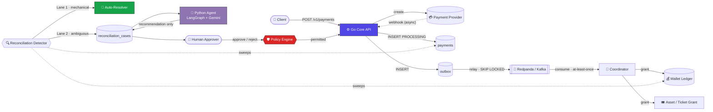
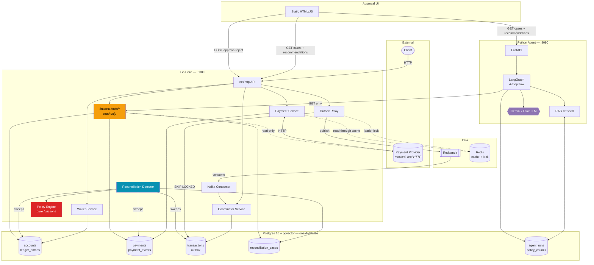
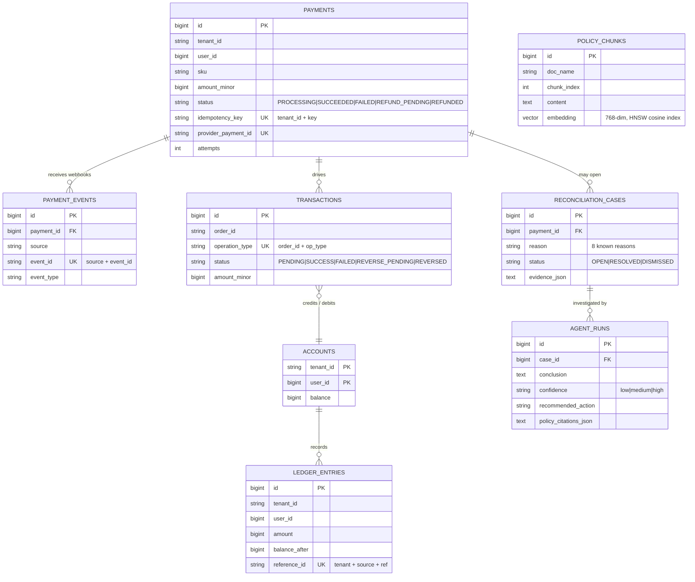
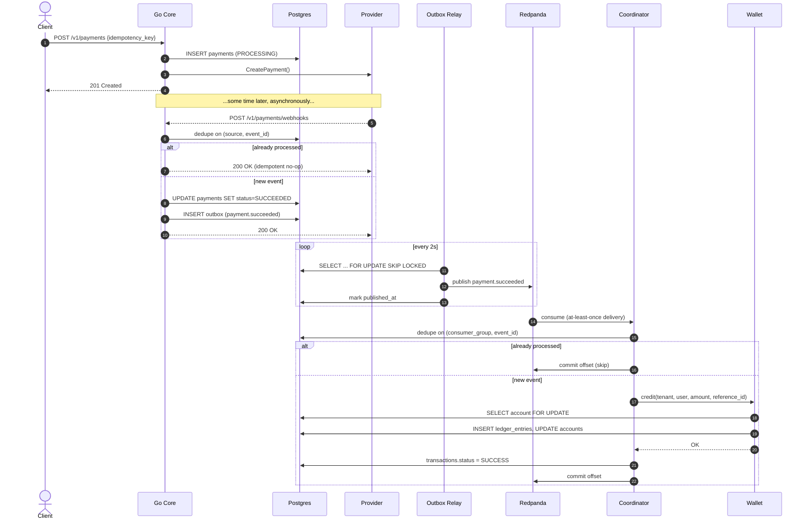
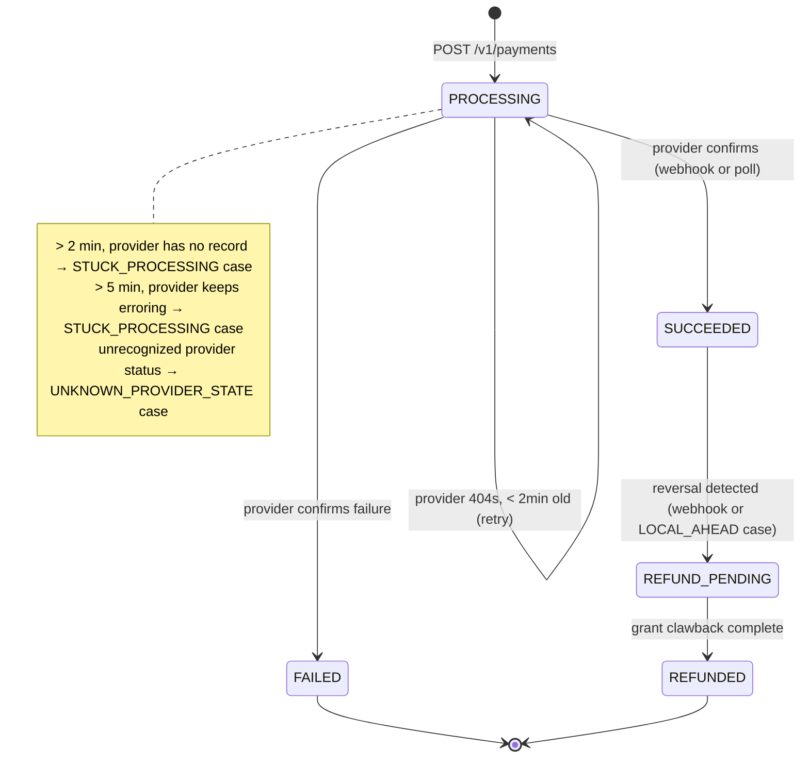
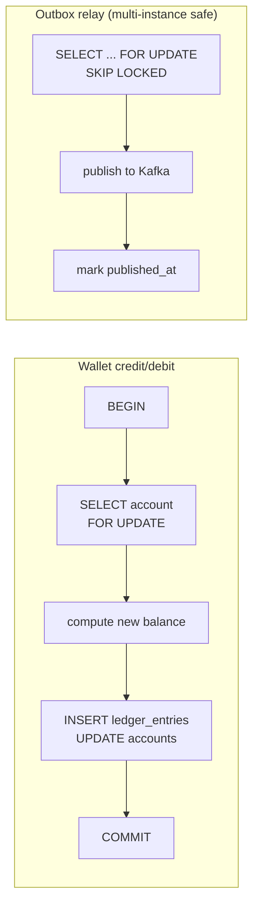
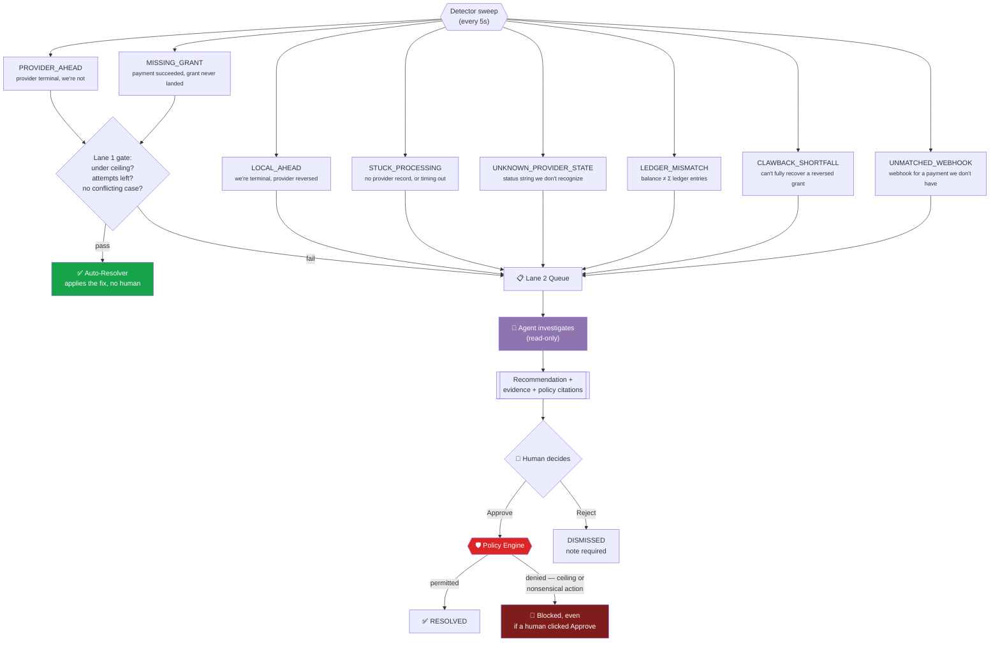
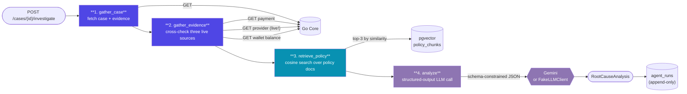
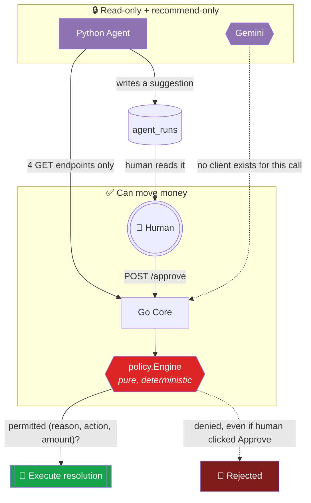
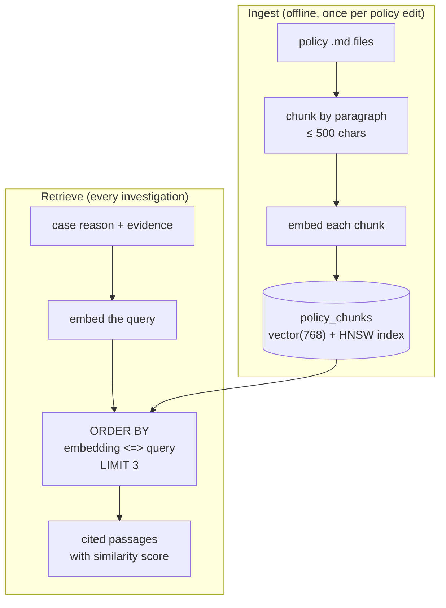

<div align="center">


[](https://git.io/typing-svg)

<br/>

[](https://go.dev)
[](https://python.org)
[](https://www.postgresql.org)
[](https://github.com/pgvector/pgvector)
[](https://redpanda.com)
[](https://redis.io)
[](https://fastapi.tiangolo.com)
[](https://langchain-ai.github.io/langgraph/)
[](https://ai.google.dev)
[](https://docker.com)

</div>

<br/>

> Most demo payment projects show you the happy path. This one is built around every way that
> path breaks — a late webhook, a duplicated delivery, two requests racing the same idempotency
> key, a provider status nobody's ever seen before — and for each one, there's a specific,
> provable answer for what the system does instead of guessing.

<br/>

## Table of Contents

<table>
<tr><td width="50%" valign="top">

**Understanding the system**
- [The 60-Second Tour](#-the-60-second-tour)
- [The Problem, Properly Stated](#-the-problem-properly-stated)
- [System Architecture](#-system-architecture)
- [Data Model](#-data-model)
- [A Purchase, End to End](#-a-purchase-end-to-end)
- [Payment State Machine](#-payment-state-machine)

</td><td width="50%" valign="top">

**Under the hood**
- [The Idempotency Matrix](#-the-idempotency-matrix)
- [Concurrency Control](#-concurrency-control)
- [Two-Lane Reconciliation](#-two-lane-reconciliation)
- [The Agentic Layer](#-the-agentic-layer)
- [The Trust Boundary](#-the-trust-boundary)
- [RAG over pgvector](#-rag-over-pgvector)

</td></tr>
<tr><td width="50%" valign="top">

**Everything else**
- [Pluggable Everything](#-pluggable-everything)
- [Tech Stack](#-tech-stack)
- [Project Structure](#-project-structure)

</td><td width="50%" valign="top">

**Doing it yourself**
- [Getting Started](#-getting-started)
- [Testing Philosophy](#-testing-philosophy)
- [What's Next](#-whats-next)

</td></tr>
</table>

<br/>

## 🎯 The 60-Second Tour

A client buys something → the core creates a `PROCESSING` payment and calls a payment provider →
the provider confirms asynchronously via webhook → an outbox+Kafka pipeline fans that out to a
coordinator, which grants wallet currency exactly once → and running underneath all of it, a
detector continuously looks for anything that drifted out of sync, fixing the mechanical cases
itself and routing the ambiguous ones to an LLM-assisted human review queue.



The whole point of the diagram above: **the LLM sits inside one small box, feeding a queue that
a human and a deterministic gate both still have to clear.** Nothing about "AI" in this system
gets to move money by itself. More on exactly why and how in [The Trust Boundary](#-the-trust-boundary).

<br/>

## 🧩 The Problem, Properly Stated

A payment isn't one event — it's a negotiation between three systems that don't share a
transaction: **our database**, **the provider**, and **the message queue that fans the result out
to grant services.** Any of the following is not a bug, it's Tuesday:

| Failure mode | What actually happens | What handles it |
|---|---|---|
| Webhook never arrives | Provider succeeded; we're still `PROCESSING` forever | `STUCK_PROCESSING` detection after a threshold |
| Webhook arrives twice | Same event delivered by an at-least-once system | `(source, event_id)` unique constraint → idempotent no-op |
| Webhook arrives, then a refund webhook we lost | Provider says `refunded`, we still say `SUCCEEDED` | `LOCAL_AHEAD` → compensate + advance |
| Two requests race the same idempotency key | Client retried a slow request | `(tenant_id, idempotency_key)` unique constraint, fingerprint-checked |
| Kafka redelivers a message | Consumer crashed after processing, before committing offset | `(consumer_group, event_id)` dedup table |
| Grant call fails after payment succeeded | Wallet credit didn't happen, payment says it did | `MISSING_GRANT` detection, redrive via coordinator |
| Provider invents a new status string | Integration hasn't been updated for a provider API change | `UNKNOWN_PROVIDER_STATE` — **always** routed to a human, never guessed |
| Ledger and account balance disagree | A bug, a race, or partial application of an update | `LEDGER_MISMATCH` — flagged, never silently patched |

Every one of these has a name, a detector, and a deterministic answer for what the system does
about it — that mapping *is* the reconciliation layer, and it's the reason this project exists.

<br/>

## 🏢 System Architecture



**Two servers, one database.** The Go core owns every write that touches money or state. The
Python agent reads from Go over plain HTTP GETs and writes to two tables of its own
(`agent_runs`, `policy_chunks`) in the *same* Postgres instance — no separate vector database,
no separate infra to operate.

<br/>

## 📊 Data Model



Two things worth noticing: **`reconciliation_cases` has a partial unique index**
`(payment_id, reason, sub_key) WHERE status = 'OPEN'`, built with raw SQL because GORM's struct
tags can't express a `WHERE` clause on a unique index — it's what stops the detector opening
five duplicate cases for the same problem on every sweep. And **`agent_runs` is append-only** —
a case can be investigated more than once as new evidence arrives, so it's a log, not a 1:1.

<br/>

## 🔄 A Purchase, End to End



If any step here fails and retries, the idempotency key at that specific layer is what makes the
retry a no-op instead of a double-charge or a double-grant. Which key, at which layer, and why —
that's the next section.

<br/>

## 🔀 Payment State Machine



`CanTransition(from, to)` is a hard-coded map in `payment/models` — every write path, whether
it's a webhook, a poll, or a reconciliation resolution, goes through the same guard. There is no
code path that sets `status` directly without checking it first.

<br/>

## 🔑 The Idempotency Matrix

Four different keys, at four different layers, because four different systems retry for four
different reasons:

| Layer | Key | Retried by | Guard mechanism |
|---|---|---|---|
| **Client request** | `(tenant_id, idempotency_key)` | Client, on timeout/retry | Unique index + fingerprint check: same key + different body ⇒ **rejected**, not silently overwritten |
| **Provider webhook** | `(source, event_id)` | Provider, at-least-once delivery | Unique index on `payment_events`; second delivery is a no-op |
| **Kafka consumer** | `(consumer_group, event_id)` | Kafka, at-least-once by design | `processed_events(consumer_group, event_id)` PK — checked before any side effect |
| **Wallet ledger** | `(tenant_id, source, reference_id)` | A redriven/retried grant | Unique index on `ledger_entries`; a retried credit can't double-apply |

The Postgres translation, used identically at every layer: a `23505` unique-violation on insert
is caught and turned into **"this already happened, return the existing result"** — success, not
an error — while a `40001` serialization failure under `READ COMMITTED` is caught and **retried**,
because it means "someone else touched this row first," not "this is wrong."

<br/>

## 🔧 Concurrency Control



- **`SELECT ... FOR UPDATE`** at `READ COMMITTED` serializes concurrent debits/credits on the
  *same* account, so two simultaneous purchases by the same user can't read-modify-write the
  balance from a stale snapshot.
- **`SKIP LOCKED`** on the outbox relay means multiple relay instances (or the same instance
  racing itself) can run the sweep concurrently without duplicating a publish — a row already
  locked by another sweep is simply skipped this round, not blocked on or double-sent.
- **Redis leader lock** on the outbox sweep is deliberately **fail-open**: if Redis is down, the
  sweep still runs (money keeps moving), it just loses the extra layer of single-flight
  protection — availability wins over that specific optimization.

<br/>

## 🚦 Two-Lane Reconciliation

The detector finds **eight** named kinds of drift. Two of them are mechanical enough to fix
automatically; the other six always go to a human — and specifically, to a human who's already
read the agent's write-up.



Lane 1's gate is intentionally strict — under the auto-resolve ceiling, attempts remaining,
authoritative evidence, and **no other open case competing for the same payment**. Anything that
fails any one of those checks drops straight to Lane 2. There is no in-between "mostly automated"
tier: a case is either fixed by code with zero human involvement, or it's read by a human who
also sees the agent's reasoning. Nothing resolves on vibes.

<br/>

## 🧠 The Agentic Layer



Four LangGraph nodes, always in this exact order, no branches or loops today. Step 2 is the one
worth dwelling on: the provider lookup is **live**, not the snapshot baked into the case's
evidence at detection time — the whole point is catching a provider status that's changed *since*
the case was opened.

The output is one fixed shape, every time:

```python
class RootCauseAnalysis(BaseModel):
    conclusion: str                        # plain-English theory of what happened
    evidence: list[str]                    # the facts that led there
    confidence: Literal["low", "medium", "high"]
    missing_information: list[str]         # what it couldn't verify — never guessed
    recommended_action: str                # a suggestion. Not a command. See below.
    policy_citations: list[PolicyCitation] # quoted, sourced passages — not remembered ones
```

Notice what's **not** in that schema: no `approved`, no `executed`, no `action_taken`. That
omission is load-bearing — see the next section.

<br/>

## 🔐 The Trust Boundary



Three **independent** layers, not one:

1. **Structural** — `CoreToolsClient`, the agent's only channel to the Go core, has exactly four
   methods, and all four are HTTP `GET`. There is no function in the entire Python codebase that
   *could* call `/approve` even if a prompt tried to talk it into doing so.
2. **Schema** — `RootCauseAnalysis` has no field that means "do this." `recommended_action` is a
   string a human reads on a web page; nothing parses it and executes it automatically.
3. **Policy** — even when a human clicks Approve with the agent's exact suggestion, Go's
   `policy.Engine.Evaluate(reason, action, amount)` independently re-checks it against a
   hard-coded permitted-actions table and a compensation ceiling. Same inputs, same answer,
   every time — no model, no variance, no exceptions.

```go
// internal/policy/engine.go — the whole safety net, in one pure function
func (e *Engine) Evaluate(reason models.Reason, action models.Action, amountMinor int64) Decision {
    allowed, ok := permittedActions[reason]
    if !ok || !allowed[action] {
        return Decision{Permitted: false, Reason: "not a permitted resolution for this reason"}
    }
    if action == models.ActionCompensate && amountMinor > e.maxCompensateMinor {
        return Decision{Permitted: false, Reason: "compensate amount exceeds the policy ceiling"}
    }
    return Decision{Permitted: true}
}
```

<br/>

## 📚 RAG over pgvector



Three short, plain-English policy documents (`refund_policy.md`, `clawback_policy.md`,
`provider_status_policy.md`) are chunked, embedded, and stored as native `vector(768)` columns in
the **same** Postgres the Go core already runs — no dedicated vector database, because a few
dozen chunks doesn't come close to earning that operational overhead. Retrieval is cosine
similarity (`<=>` operator) over an HNSW index, ranked and limited entirely inside Postgres.

Why this matters over just trusting the model's training data: the LLM can only cite what's
*actually written* in this company's policy docs, quoted verbatim with a similarity score — not
what it half-remembers about refund policy in general.

<br/>

## 🔌 Pluggable Everything

Every external dependency in this system — a payment gateway, a grant service, an LLM, an
embedding model — has a real implementation and a deterministic fake behind the same interface.
The rest of the code never knows or cares which one it's holding.

| Interface | Real implementation | Deterministic fake | Why it matters |
|---|---|---|---|
| `provider.Provider` | `HTTPProvider` → mock PSP over HTTP | `SimulatedProvider` (in-memory) | Every Go test runs without a live payment gateway |
| `coordinatorgranter.TicketGranter` | `HTTPTicketGranter` | `InMemoryGranter` | Grant-failure scenarios are constructed, not waited for |
| `llm.LLMClient` | `GeminiLLMClient` (structured output) | `FakeLLMClient` (rule-based) | The whole agent runs with **zero API key, zero cost** |
| `rag.Embedder` | `GeminiEmbedder` (`text-embedding-004`) | `FakeEmbedder` (hashed shingles, unit-normalized) | RAG retrieval is fully tested offline |

**Practical result:** `GEMINI_API_KEY` unset is not a degraded mode — it's the default,
documented, fully-tested state. Clone the repo, run the tests, run the demo, all without signing
up for anything.

<br/>

## 🧰 Tech Stack

<div align="center">

| Layer | Choice | Why |
|---|---|---|
| Core language | **Go** | Static typing, cheap concurrency, one static binary per service |
| ORM | **GORM** over Postgres | Struct-tag migrations for the common case, raw SQL for the partial index GORM can't express |
| Message bus | **Redpanda** (Kafka API) | One container instead of Kafka's usual two (no separate ZooKeeper) |
| Cache / lock | **Redis** | Read-through cache + a fail-open leader lock, nothing load-bearing depends on it being up |
| Agent framework | **FastAPI + LangGraph** | Explicit, inspectable 4-node flow; a typed HTTP surface with 4 routes, no more |
| LLM | **Google Gemini** (structured output) | Generous free tier + first-class JSON-schema-constrained generation |
| Vector search | **pgvector** in the existing Postgres | A few dozen chunks doesn't justify a dedicated vector DB |
| Approval UI | **Static HTML/JS**, zero build step | One page, four fetch calls, nothing to compile |
| Infra | **Docker Compose** | `docker compose up -d` and the whole backing stack is live |

</div>

<br/>

## 📂 Project Structure

<details>
<summary><b>Click to expand the full tree</b></summary>

```
payguard/
├── core/                          Go service
│   ├── cmd/
│   │   ├── server/                 the real app — :8080
│   │   ├── mockprovider/            always-honest fake PSP — :9090
│   │   └── grantstub/                fake asset/ticket grant service — :9100
│   └── internal/
│       ├── wallet/                  accounts, ledger_entries
│       ├── payment/                  payments, payment_events
│       ├── coordinator/               transactions, grant orchestration
│       ├── provider/                   real + simulated payment gateway client
│       ├── outbox/                      transactional outbox relay
│       ├── kafka/                        producer, consumer, DLQ routing
│       ├── cache/                         Redis wrapper
│       ├── reconcile/
│       │   ├── detector/                  8-reason drift detection
│       │   ├── service/                    resolve(), auto-resolver, Lane 1 gate
│       │   └── httpapi/                     /v1/reconciliation-cases/*
│       ├── policy/                       deterministic permitted-action engine
│       ├── tools/httpapi/                 /internal/tools/* — agent's read-only surface
│       └── unmatchedwebhook/               orphaned webhook capture
│
├── agent/                          Python service
│   ├── app/
│   │   ├── main.py                    FastAPI — 4 routes total
│   │   ├── agent_graph.py              the LangGraph 4-step flow
│   │   ├── investigate.py               wires deps, runs the flow, persists
│   │   ├── tools_client.py               the agent's only Go client — 4 GET methods
│   │   ├── schemas.py                     RootCauseAnalysis and friends
│   │   ├── agent_runs_repo.py              save / read recommendations
│   │   ├── llm/
│   │   │   ├── gemini_client.py               real, structured-output Gemini call
│   │   │   └── fake_client.py                  deterministic rule-based stand-in
│   │   ├── rag/
│   │   │   ├── embeddings.py                   real + fake embedders
│   │   │   ├── ingest.py                        chunk → embed → store
│   │   │   └── retrieve.py                       cosine search over pgvector
│   │   └── policies/                     the 3 source-of-truth policy documents
│   ├── migrations/                     agent_runs + policy_chunks DDL
│   ├── tests/                          9 tests, zero network calls required
│   └── ui/
│       └── index.html                    the entire approval UI, one file
│
└── docker-compose.yml               postgres (pgvector), redpanda, redis
```

</details>

<br/>

## 🚀 Getting Started

<details open>
<summary><b>1. Infrastructure</b></summary>

```bash
docker compose up -d       # postgres (with pgvector), redpanda, redis
```

</details>

<details>
<summary><b>2. Go core + its fakes</b></summary>

```bash
cd payguard/core
cp config.example.json config.json      # defaults work as-is locally
go run ./cmd/mockprovider &              # fake payment gateway  — :9090
go run ./cmd/grantstub &                  # fake grant service    — :9100
go run ./cmd/server &                      # the core API           — :8080
```

</details>

<details>
<summary><b>3. Python agent</b></summary>

```bash
cd payguard/agent
python3.12 -m venv .venv && source .venv/bin/activate
pip install -r requirements.txt

python -m app.migrate          # idempotent — creates agent_runs + policy_chunks
python -m app.rag.ingest       # chunk + embed the policy docs (fake embedder if no key set)
uvicorn app.main:app --port 8090 &
```

Leaving `GEMINI_API_KEY` unset in `.env` runs the whole pipeline — evidence gathering, RAG
retrieval, structured recommendation, persistence — on deterministic fakes. No key, no cost, no
external call, same code path.

</details>

<details>
<summary><b>4. The approval UI</b></summary>

```bash
cd payguard/agent/ui
python3 -m http.server 8091
# open http://localhost:8091
```

</details>

<br/>

## 🧪 Testing Philosophy

```bash
cd payguard/core  && go test -race ./...           # unit + integration, real local Postgres
cd payguard/agent && python -m pytest tests/ -v     # unit + integration, zero network calls
```

Both suites test the same principle from opposite ends: **never test whether the AI's answer is
subjectively good — test whether the wiring around it is provably correct.** The fake LLM lets
every structural guarantee get asserted directly and deterministically:

```python
def test_never_produces_an_approve_or_execute_field():
    """A regression here would mean the schema itself could carry an authorization —
    checked directly against the model's fields, not inferred from behavior."""
    fields = set(RootCauseAnalysis.model_fields.keys())
    assert "approved" not in fields
    assert "executed" not in fields
    assert "action_taken" not in fields
```

Integration tests on both sides of the language boundary follow the same convention: skip
automatically if their live dependency (a real Postgres, a running Go core) isn't up, rather than
failing the whole suite in an environment that hasn't started infra yet.

<br/>

## 🧭 What's Next

- **Streaming investigations** — show a human the agent's reasoning as each of the 4 steps
  completes, instead of waiting for the full round trip.
- **A labeled eval set** — `agent_runs` is already an append-only log of every recommendation
  ever made; pairing it with human approve/reject outcomes is the raw material for tracking
  whether the model's recommendations are actually getting better or drifting over time.
- **Semantic chunking** for the policy corpus once it grows past a handful of documents —
  fixed-paragraph packing is a reasonable start at 3 documents, not at 300.

<br/>

<div align="center">


</div>
